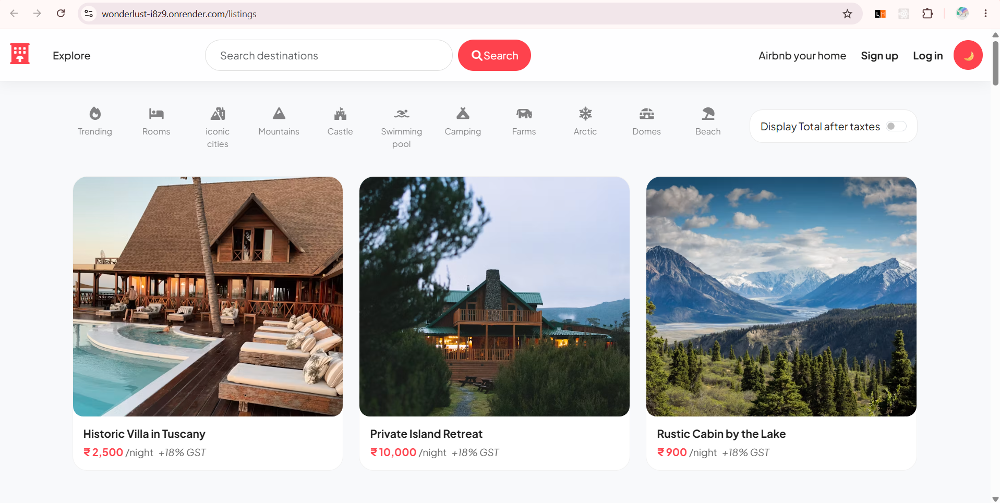
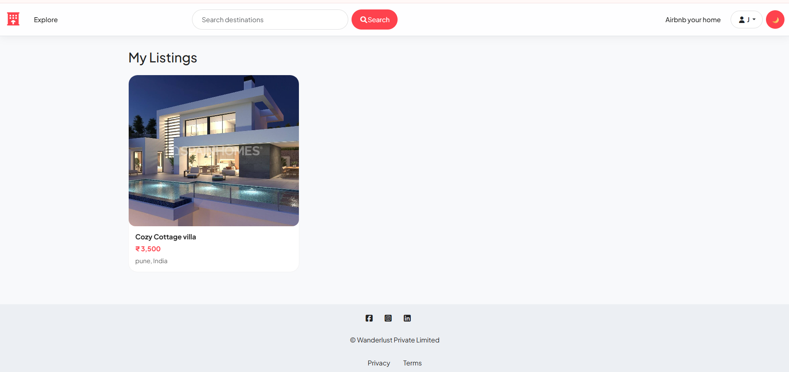
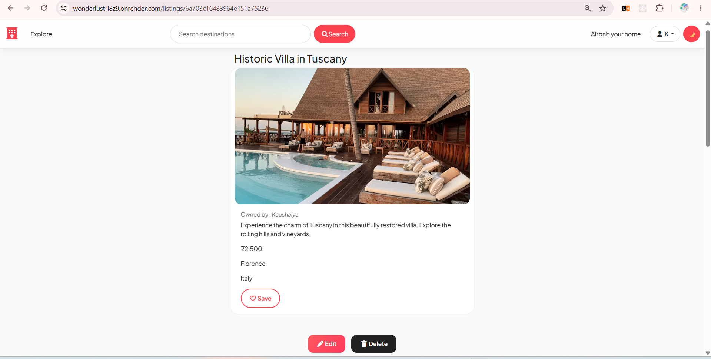
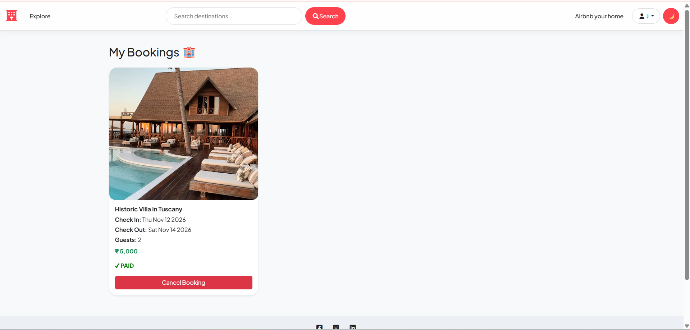
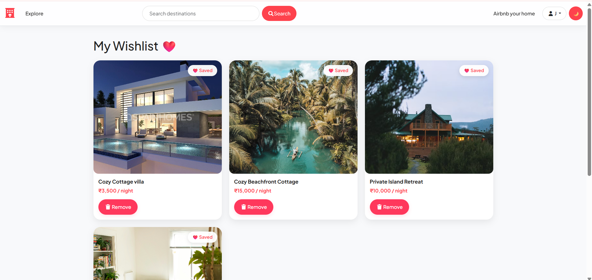
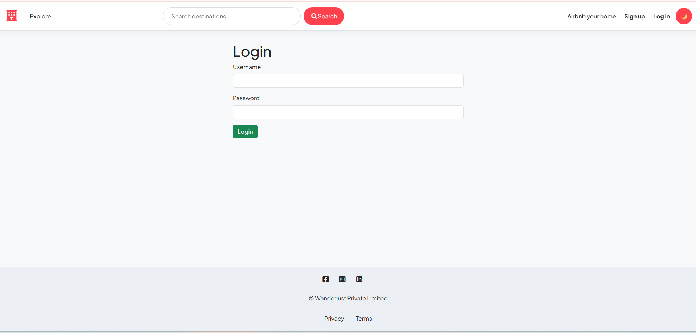
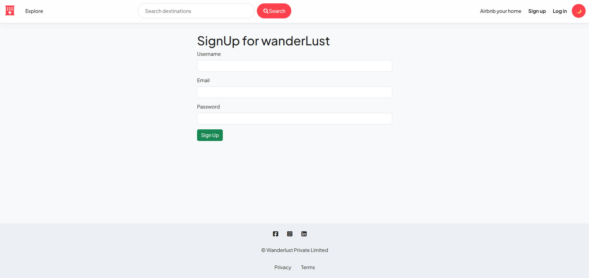
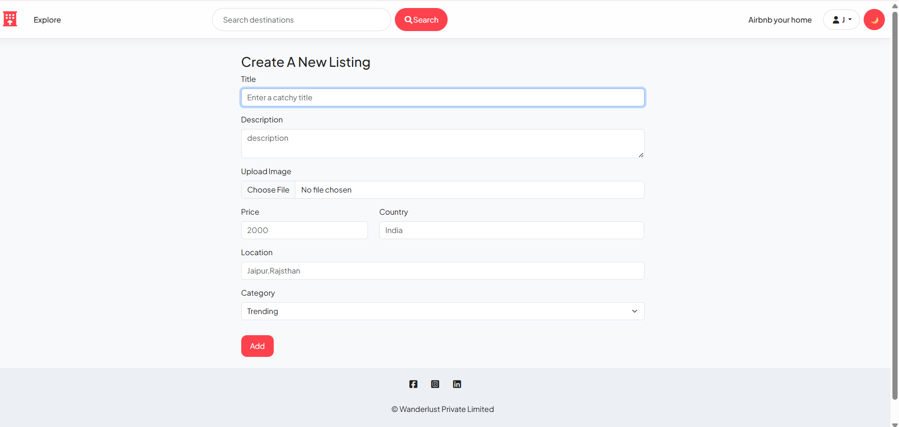
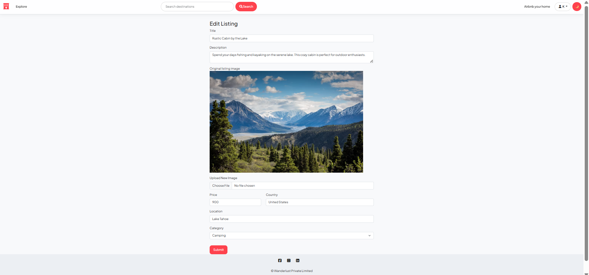
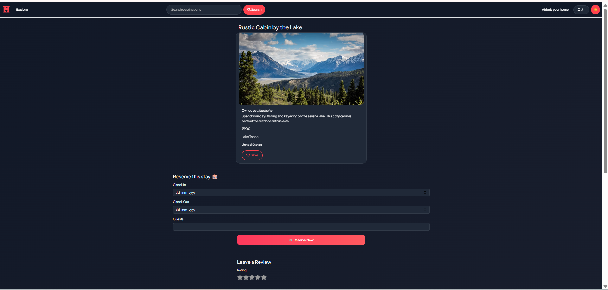

# 🏡 WonderLust 

WonderLust is a full-stack accommodation booking web application inspired by platforms like Airbnb. Users can explore property listings, view detailed information, create listings, manage their own properties, leave reviews, and make bookings.

The project was built to practice **full-stack web development**, including frontend rendering, REST APIs, authentication, authorization, database management, sessions, validation, image uploads, maps, and deployment.

---

## 🚀 Features

* 🔐 User Signup & Login
* 👤 User Authentication & Authorization
* 🏠 Create, Read, Update & Delete Listings
* 🖼️ Upload Listing Images
* 📍 Location-based Listings
* 🗺️ Interactive Maps using OpenStreetMap & Leaflet
* 🔎 Location Geocoding using OpenStreetMap Nominatim
* ⭐ Add and Delete Reviews
* ❤️ Wishlist functionality
* 📅 Booking / Reservation System
* 💰 Automatic Booking Price Calculation
* 💳 Payment Status Handling
* 🌙 Dark Mode
* 🔔 Flash Messages
* 🛡️ Server-side Validation
* 📱 Responsive UI
* ☁️ MongoDB Atlas Database
* 🚀 Deployment-ready configuration

---
## 🌐 Live Demo

🚀 **[View WonderLust Live](https://wonderlust-i8z9.onrender.com/listings)**

---

## 📸 Screenshots

### 🏠 Home Page



### 🏡 My Listings 



### 📄 Listing Details



### 📅 Booking



### ❤️ Wishlist



### 🔑 Login page



### 🔐 Signup page



### ➕ Create Listing



### ✏️ Edit Listing



### 🌙 Dark Mode



---

## 🛠️ Tech Stack

### Frontend

* HTML5
* CSS3
* JavaScript
* Bootstrap
* EJS
* EJS-Mate
* Font Awesome

### Backend

* Node.js
* Express.js
* RESTful APIs
* Express Router
* Express Session
* Connect-Mongo
* Connect-Flash

### Database

* MongoDB
* MongoDB Atlas
* Mongoose

### Development Tools

* Node Package Manager (NPM)
* Nodemon
* Git
* GitHub
* VS Code

### Deployment

* Render
* MongoDB Atlas
* Cloudinary

---

## ⚙️ Installation

### 1. Clone the repository

```bash
git clone https://github.com/your-username/wonderlust.git
```

### 2. Move into the project

```bash
cd wonderlust
```

### 3. Install dependencies

```bash
npm install
```

### 4. Create `.env`

Add your MongoDB Atlas, session and Cloudinary credentials.

### 5. Start the development server

```bash
npm start


---

## 👨‍💻 Author

**Kaushalya Shahapure**

---

## ⭐ If You Like This Project

If you find this project useful, consider giving the repository a ⭐ on GitHub.
